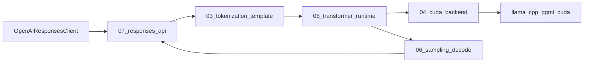

# Dissected LLM Inference Provider

This repository is a staged, learning-focused LLM inference provider. It is
organized so each numbered folder explains one part of GPU inference while the
runtime path can delegate heavy tensor work to existing high-performance
llama.cpp/ggml CUDA kernels.

The default target model family is Qwen3 GGUF from Hugging Face, especially:

- `Qwen/Qwen3-8B-GGUF`
- `Qwen3-8B-Q4_K_M.gguf` for an approachable quantized default
- `Qwen3-8B-Q8_0.gguf` for higher quality when memory allows

## Stage index

| Stage | Folder | Purpose |
| --- | --- | --- |
| 00 | [`src/00_common`](src/00_common) | Shared status, JSON, filesystem, and process helpers. |
| 01 | [`src/01_gguf_loading`](src/01_gguf_loading) | Educational GGUF parser and tensor/metadata inspector. |
| 02 | [`src/02_huggingface_models`](src/02_huggingface_models) | Qwen3 GGUF presets and Hugging Face download/cache helpers. |
| 03 | [`src/03_tokenization_template`](src/03_tokenization_template) | Qwen3 prompt formatting, thinking-mode handling, and tokenizer bridge notes. |
| 04 | [`src/04_cuda_backend`](src/04_cuda_backend) | llama.cpp backend boundary and CUDA kernel reference registry. |
| 05 | [`src/05_transformer_runtime`](src/05_transformer_runtime) | Model context, KV cache concepts, prefill/decode session runtime. |
| 06 | [`src/06_sampling_decode`](src/06_sampling_decode) | Sampling defaults, stop conditions, and streaming UTF-8 assembly. |
| 07 | [`src/07_responses_api`](src/07_responses_api) | Text-focused OpenAI Responses-compatible HTTP API. |
| 08 | [`src/08_observability_bench`](src/08_observability_bench) | Tracing and benchmark utilities for prefill/decode learning. |

Additional references:

- [`docs/kernels/cuda_kernel_map.md`](docs/kernels/cuda_kernel_map.md)
- [`docs/api/responses_api.md`](docs/api/responses_api.md)
- [`external/README.md`](external/README.md)

## Architecture



The educational code parses and explains model artifacts. The optimized
inference path is intentionally routed through llama.cpp/ggml so CUDA kernels,
quantized matrix operations, RoPE, attention, and KV-cache code stay aligned
with a widely used high-performance implementation.

## Quickstart

Install or clone llama.cpp as described in [`external/README.md`](external/README.md),
then download a Qwen3 GGUF model:

```bash
hf download Qwen/Qwen3-8B-GGUF Qwen3-8B-Q4_K_M.gguf --local-dir models/qwen3-8b-gguf
```

Build this project:

```bash
cmake -S . -B build -DDISSECTED_LLM_CUDA=ON
cmake --build build -j
```

Inspect the GGUF container:

```bash
./build/dissected-gguf-inspect models/qwen3-8b-gguf/Qwen3-8B-Q4_K_M.gguf
```

Run the Responses API server. If `--llama-cli` is provided, requests are sent to
llama.cpp for real generation; otherwise the server returns a deterministic
educational response that exercises the API layer.

```bash
./build/dissected-llm-server \
  --model models/qwen3-8b-gguf/Qwen3-8B-Q4_K_M.gguf \
  --llama-cli external/llama.cpp/build/bin/llama-cli \
  --host 0.0.0.0 \
  --port 8000 \
  --gpu-layers 99
```

Call the text-focused OpenAI Responses-compatible endpoint:

```bash
curl http://localhost:8000/v1/responses \
  -H 'Content-Type: application/json' \
  -d '{"model":"qwen3-8b-q4_k_m","input":"Explain KV cache in one paragraph /no_think","max_output_tokens":256}'
```

Streaming uses Server-Sent Events:

```bash
curl -N http://localhost:8000/v1/responses \
  -H 'Content-Type: application/json' \
  -d '{"model":"qwen3-8b-q4_k_m","input":"What is prefill? /no_think","stream":true}'
```

## OpenAI Responses API scope

Implemented first:

- `POST /v1/responses`
- Text `input` and optional `instructions`
- `temperature`, `top_p`, `max_output_tokens`, `stream`
- Responses-style JSON object and SSE text deltas

Explicitly unsupported for now:

- hosted web search, file search, code interpreter
- image/audio input
- background jobs
- hosted conversations

Unsupported features return a `501 unsupported_feature` error shape instead of
silently changing semantics.

## CUDA kernel reference map

The runtime is designed to use llama.cpp/ggml CUDA operations for performance:

- quantized matrix-vector/matrix-matrix multiplication for GGUF tensor types
- RMSNorm and normalization kernels
- RoPE positional embedding kernels
- flash-attention-capable paths when llama.cpp is built with CUDA support
- KV-cache movement and attention kernels

See [`docs/kernels/cuda_kernel_map.md`](docs/kernels/cuda_kernel_map.md) for the
stage-by-stage mapping.
